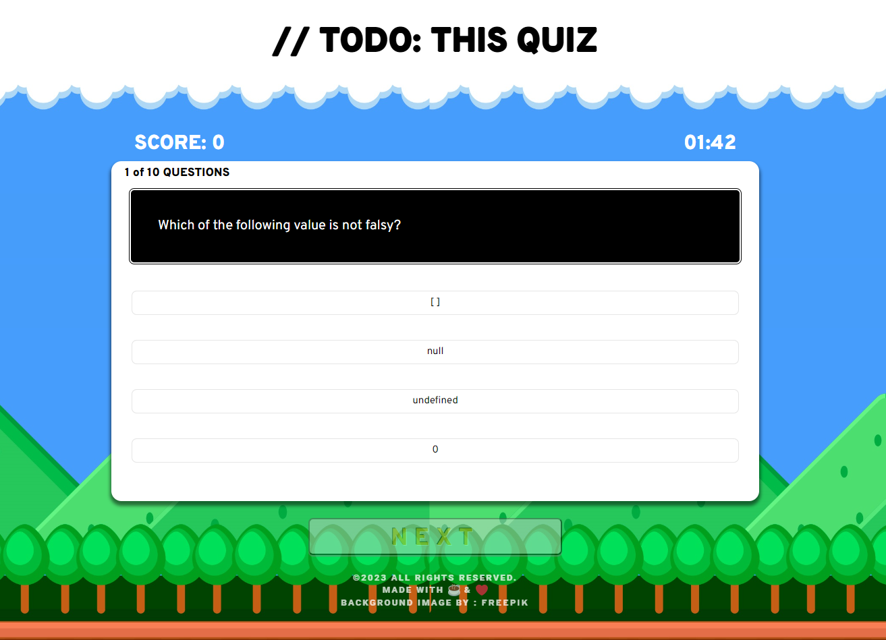

# //TODO: THIS QUIZ!

This is a game-themed quiz app that tests your knowledge of the basics of JavaScript. Can you get a perfect score?

## Description

It is a timed (2-minute) quiz that will deduct 10 seconds from your remaining time if you answer incorrectly but it will add 1 point to the score if you answer correctly. There is a total of 10 questions to solve! At the end of the quiz, you will be able to save your score and initials to the scoreboard. Highest scores will be displayed at the top of the scoreboard. If same score is achieved, the initials will be displayed in the order it was entered.

* Developed using HTML, CSS, and JavaScript.
* Google Fonts (Overpass and Roboto) were used for the fonts.
* Background image was taken from [FREEPIK](https://www.freepik.com).

## Getting Started

### Dependencies

All you need is a web browser to run this app.

### Installing

* Download the zip file or clone the repository to your local machine.
* Open the index.html file in your web browser.

  OR

* You can simply click on the link to run the app:
[//TODO: THIS QUIZ!](https://jyoungjoon.github.io/-TODO-THIS.QUIZ/)

## Authors

Young Jang - [Github](https://github.com/jyoungjoon)

## Version History

* 0.1
    * Initial Release

## License

This project is licensed under the [MIT] License - see the LICENSE.md file for details

## Acknowledgments

Inspiration, code snippets, etc.
* [awesome-readme](https://github.com/matiassingers/awesome-readme)
* [PurpleBooth](https://gist.github.com/PurpleBooth/109311bb0361f32d87a2)
* [dbader](https://github.com/dbader/readme-template)
* [zenorocha](https://gist.github.com/zenorocha/4526327)
* [fvcproductions](https://gist.github.com/fvcproductions/1bfc2d4aecb01a834b46)